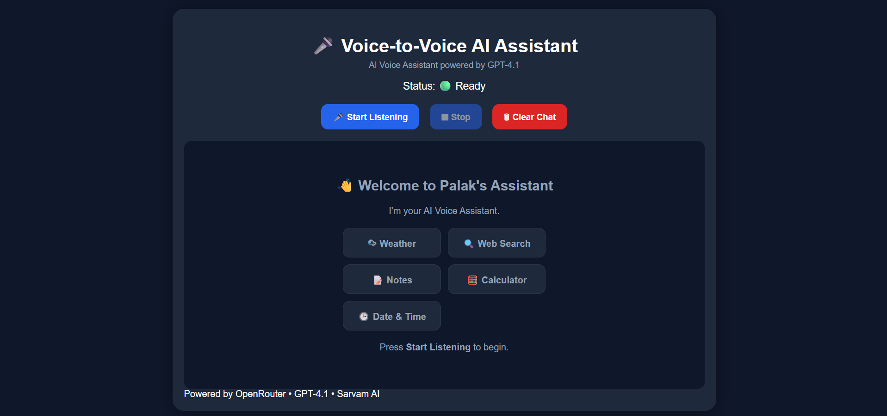
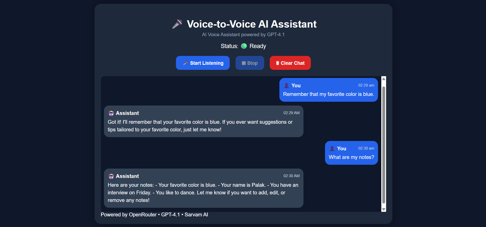

# 🎤 Voice-to-Voice AI Assistant

An AI-powered voice assistant that enables natural voice conversations using Speech-to-Text, Large Language Models, and Text-to-Speech. The assistant can answer general questions, perform web searches, provide weather updates, solve mathematical calculations, manage notes, and respond conversationally.

---

## 🚀 Live Demo

🌐 Frontend (Vercel)  
https://voice-to-voice-ai-assistant-rust.vercel.app/

⚙️ Backend (Render)  
https://voice-to-voice-ai-assistant.onrender.com/

---

# ✨ Features

- 🎙️ Voice Recording
- 📝 Speech-to-Text using Sarvam AI
- 🤖 AI Responses powered by OpenRouter GPT-4.1
- 🌦️ Real-time Weather Information
- 🔍 Web Search
- 🧮 Calculator Tool
- 📝 Notes Creation & Retrieval
- 📅 Current Date & Time
- 🔊 Browser Text-to-Speech
- 💬 Chat Interface
- 📱 Responsive Design (Desktop & Mobile)

---

# 🛠️ Tech Stack

## Frontend
- SvelteKit
- TypeScript
- HTML5
- CSS3

## Backend
- Node.js
- Express.js
- TypeScript

## AI Services
- OpenRouter GPT-4.1
- Sarvam AI (Speech-to-Text)
- Browser Speech Synthesis API

## External APIs
- Tavily Search API
- OpenWeather API

## Deployment
- Vercel (Frontend)
- Render (Backend)

---

# 🏗️ System Architecture

```
                User
                  │
                  ▼
        🎤 Voice Recording
                  │
                  ▼
      Sarvam AI Speech-to-Text
                  │
                  ▼
          AI Agent (GPT-4.1)
                  │
      ┌───────────┼────────────┐
      │           │            │
      ▼           ▼            ▼
 Weather      Web Search    Calculator
      │           │            │
      └───────────┼────────────┘
                  │
                  ▼
         AI Generated Response
                  │
                  ▼
 Browser Text-to-Speech + Chat UI
```

---

# 📂 Project Structure

```
Voice-to-Voice-AI-Assistant/

│
├── frontend/
│   ├── src/
│   ├── static/
│   └── package.json
│
├── backend/
│   ├── src/
│   │   ├── services/
│   │   ├── tools/
│   │   └── server.ts
│   ├── uploads/
│   └── package.json
│
├── README.md
└── .gitignore
```

---

# ⚙️ Installation

## Clone the repository

```bash
git clone https://github.com/palak-s8/Voice-to-Voice-AI-Assistant.git
```

```bash
cd Voice-to-Voice-AI-Assistant
```

---

## Install Frontend

```bash
cd frontend
npm install
```

---

## Install Backend

```bash
cd backend
npm install
```

---

# 🔑 Environment Variables

Create a `.env` file inside the backend folder.

```env
SARVAM_API_KEY=your_key

OPENROUTER_API_KEY=your_key

TAVILY_API_KEY=your_key

OPENWEATHER_API_KEY=your_key
```

---

# ▶️ Running the Project

## Backend

```bash
cd backend
npm start
```

## Frontend

```bash
cd frontend
npm run dev
```

---

# 🧠 AI Workflow

1. User records voice.
2. Audio is uploaded to the Express backend.
3. Sarvam AI converts speech into text.
4. GPT-4.1 processes the request.
5. The AI Agent selects the appropriate tool when required.
6. Tool results are returned to GPT.
7. GPT generates the final response.
8. Response is displayed in the chat.
9. Browser Speech Synthesis speaks the response.

---

# 📸 Screenshots

## Home Screen



## Voice Conversation



---

# 🔮 Future Improvements

- Conversation Memory
- Multiple Language Support
- Voice Selection
- Authentication
- Database Storage
- User Profiles
- AI Personalization
- Conversation History

---

# 👩‍💻 Author

**Palak Shah**

Information Technology Engineering Student

GitHub: https://github.com/palak-s8

---

# 📄 License

This project is licensed under the MIT License.